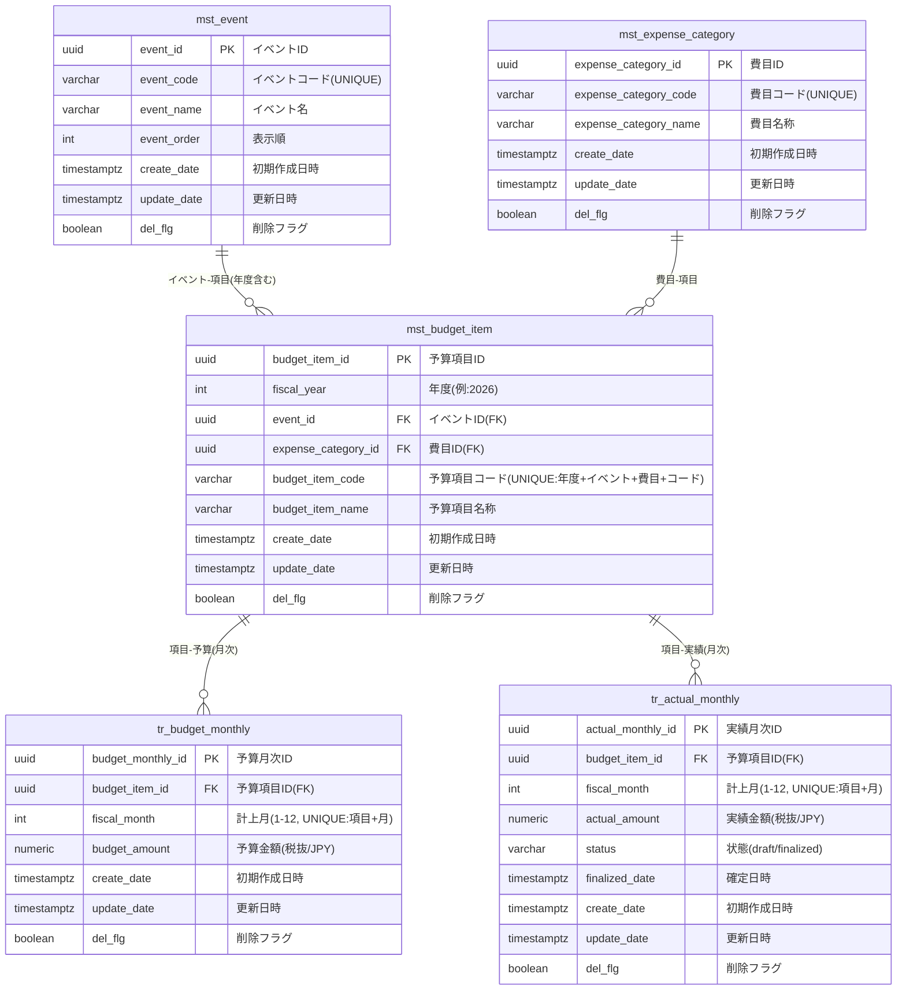

## Constraints and Indexes

### UNIQUE
- mst_event(event_code)
- mst_expense_category(expense_category_code)
- mst_budget_item(fiscal_year, event_id, expense_category_id, budget_item_code)
- tr_budget_monthly(budget_item_id, fiscal_month)
- tr_actual_monthly(budget_item_id, fiscal_month)

### INDEX (join performance)
- mst_budget_item(fiscal_year, event_id)
- mst_budget_item(expense_category_id)
- tr_budget_monthly(budget_item_id)
- tr_actual_monthly(budget_item_id)
