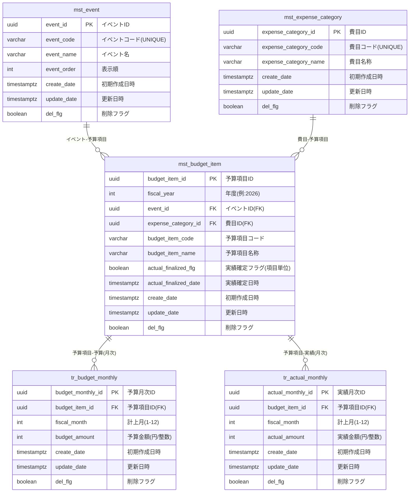

# ER図

前提:
- 年度は `mst_budget_item.fiscal_year` で管理
- 金額は円単位の整数
- 実績確定は項目単位 (`mst_budget_item.actual_finalized_flg`)

## 主要制約
- `mst_event.event_code` は一意
- `mst_expense_category.expense_category_code` は一意
- `mst_budget_item(fiscal_year, event_id, expense_category_id, budget_item_code)` は一意
- `tr_budget_monthly(budget_item_id, fiscal_month)` は一意
- `tr_actual_monthly(budget_item_id, fiscal_month)` は一意
- `fiscal_month` は 1..12
