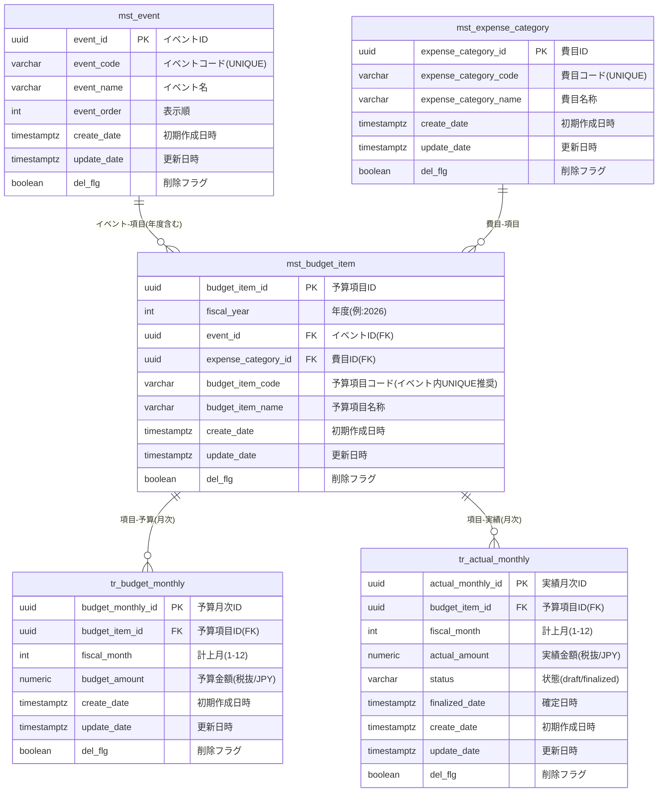

```mermaid
erDiagram
  mst_event {
    uuid event_id PK          "イベントID"
    varchar event_code        "イベントコード(UNIQUE)"
    varchar event_name        "イベント名"
    int event_order           "表示順"
    timestamptz create_date   "初期作成日時"
    timestamptz update_date   "更新日時"
    boolean del_flg           "削除フラグ"
  }

  mst_expense_category {
    uuid expense_category_id PK        "費目ID"
    varchar expense_category_code      "費目コード(UNIQUE)"
    varchar expense_category_name      "費目名称"
    timestamptz create_date            "初期作成日時"
    timestamptz update_date            "更新日時"
    boolean del_flg                    "削除フラグ"
  }

  mst_budget_item {
    uuid budget_item_id PK             "予算項目ID"
    int fiscal_year                    "年度(例:2026)"
    uuid event_id FK                   "イベントID(FK)"
    uuid expense_category_id FK        "費目ID(FK)"
    varchar budget_item_code           "予算項目コード(イベント内UNIQUE推奨)"
    varchar budget_item_name           "予算項目名称"
    timestamptz create_date            "初期作成日時"
    timestamptz update_date            "更新日時"
    boolean del_flg                    "削除フラグ"
  }

  tr_budget_monthly {
    uuid budget_monthly_id PK          "予算月次ID"
    uuid budget_item_id FK             "予算項目ID(FK)"
    int fiscal_month                   "計上月(1-12)"
    numeric budget_amount              "予算金額(税抜/JPY)"
    timestamptz create_date            "初期作成日時"
    timestamptz update_date            "更新日時"
    boolean del_flg                    "削除フラグ"
  }

  tr_actual_monthly {
    uuid actual_monthly_id PK          "実績月次ID"
    uuid budget_item_id FK             "予算項目ID(FK)"
    int fiscal_month                   "計上月(1-12)"
    numeric actual_amount              "実績金額(税抜/JPY)"
    varchar status                     "状態(draft/finalized)"
    timestamptz finalized_date         "確定日時"
    timestamptz create_date            "初期作成日時"
    timestamptz update_date            "更新日時"
    boolean del_flg                    "削除フラグ"
  }

  mst_event ||--o{ mst_budget_item : "イベント-項目(年度含む)"
  mst_expense_category ||--o{ mst_budget_item : "費目-項目"
  mst_budget_item ||--o{ tr_budget_monthly : "項目-予算(月次)"
  mst_budget_item ||--o{ tr_actual_monthly : "項目-実績(月次)"
```
